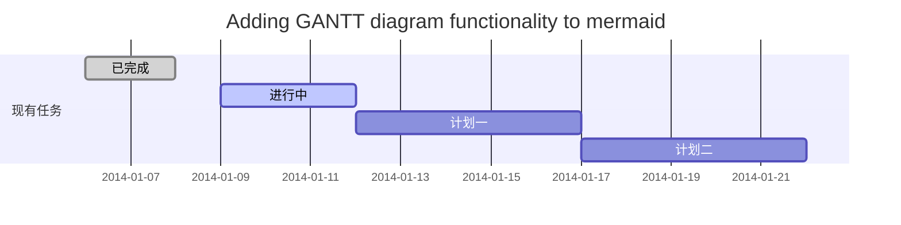
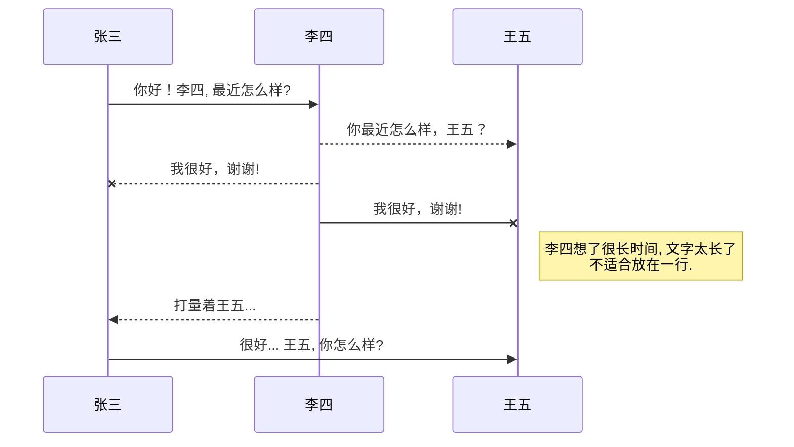
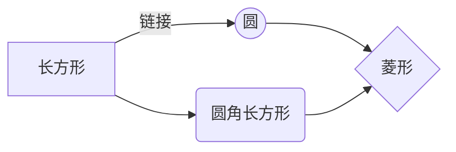

@[TOC](这里写自定义目录标题)

# 欢迎使用Markdown编辑器

你好！ 这是你第一次使用 **Markdown编辑器** 所展示的欢迎页。如果你想学习如何使用Markdown编辑器, 可以仔细阅读这篇文章，了解一下Markdown的基本语法知识。


 [^1]: [mermaid语法说明](https://mermaidjs.github.io/)

## 功能快捷键

撤销：<kbd>Ctrl/Command</kbd> + <kbd>Z</kbd> <br>
重做：<kbd>Ctrl/Command</kbd> + <kbd>Y</kbd> <br>
加粗：<kbd>Ctrl/Command</kbd> + <kbd>B</kbd> <br>
斜体：<kbd>Ctrl/Command</kbd> + <kbd>I</kbd> <br>
标题：<kbd>Ctrl/Command</kbd> + <kbd>Shift</kbd> + <kbd>H</kbd> <br>
无序列表：<kbd>Ctrl/Command</kbd> + <kbd>Shift</kbd> + <kbd>U</kbd> <br>
有序列表：<kbd>Ctrl/Command</kbd> + <kbd>Shift</kbd> + <kbd>O</kbd> <br>
检查列表：<kbd>Ctrl/Command</kbd> + <kbd>Shift</kbd> + <kbd>C</kbd> <br>
插入代码：<kbd>Ctrl/Command</kbd> + <kbd>Shift</kbd> + <kbd>K</kbd> <br>
插入链接：<kbd>Ctrl/Command</kbd> + <kbd>Shift</kbd> + <kbd>L</kbd> <br>
插入图片：<kbd>Ctrl/Command</kbd> + <kbd>Shift</kbd> + <kbd>G</kbd> <br>
查找：<kbd>Ctrl/Command</kbd> + <kbd>F</kbd> <br>
替换：<kbd>Ctrl/Command</kbd> + <kbd>G</kbd> <br>

## 合理的创建标题，有助于目录的生成

直接输入1次 <kbd>#</kbd>，并按下<kbd>space</kbd>后，将生成1级标题。 <br>
输入2次<kbd>#</kbd>，并按下<kbd>space</kbd>后，将生成2级标题。 <br>
以此类推，我们支持6级标题。有助于使用`TOC`语法后生成一个完美的目录。 <br>

## 如何改变文本的样式

`*强调文本*` _强调文本_

`**加粗文本**` __加粗文本__

`==标记文本==` ==标记文本==

`~~删除文本~~` ~~删除文本~~

`> 引用文本` > 引用文本

## 插入链接与图片

链接: [link](https://www.csdn.net/).

图片: 


## 生成一个适合你的列表

- 项目
  - 项目
    - 项目

1. 项目1
2. 项目2
3. 项目3

- [ ] 计划任务
- [x] 完成任务

## 创建一个表格
一个简单的表格是这么创建的：

项目     | Value
-------- | -----
电脑  | $1600
手机  | $12
导管  | $1

### 设定内容居中、居左、居右
使用`:---------:`居中 <br>
使用`:----------`居左 <br>
使用`----------:`居右 <br>

| 第一列       | 第二列         | 第三列        |
|:-----------:| -------------:|:-------------|
| 第一列文本居中 | 第二列文本居右  | 第三列文本居左 |

### SmartyPants
SmartyPants将ASCII标点字符转换为“智能”印刷标点HTML实体。例如：

|    TYPE   |ASCII                          |HTML
|----------------|-------------------------------|-----------------------------|
|Single backticks|`'Isn't this fun?'`            |'Isn't this fun?'            |
|Quotes          |`"Isn't this fun?"`            |"Isn't this fun?"            |
|Dashes          |`-- is en-dash, --- is em-dash`|-- is en-dash, --- is em-dash|

## 创建一个自定义列表
Markdown

:  Text-to-HTML conversion tool

Authors

:  John
:  Luke


!> 以下功能未调试完成

## 新的甘特图功能，丰富你的文章


- 关于 **甘特图** 语法，参考 [这儿][2],

## UML 图表

可以使用UML图表进行渲染。 [Mermaid](https://mermaidjs.github.io/). 例如下面产生的一个序列图：



这将产生一个流程图。:



- 关于 **Mermaid** 语法，参考 [这儿][3],

## FLowchart流程图

我们依旧会支持flowchart的流程图：
```mermaid
flowchat
st=>start: 开始
e=>end: 结束
op=>operation: 我的操作
cond=>condition: 确认？

st->op->cond
cond(yes)->e
cond(no)->op
```

- 关于 **Flowchart流程图** 语法，参考 [这儿][4].


 [1]: http://meta.math.stackexchange.com/questions/5020/mathjax-basic-tutorial-and-quick-reference
 [2]: https://mermaidjs.github.io/
 [3]: https://mermaidjs.github.io/
 [4]: http://adrai.github.io/flowchart.js/