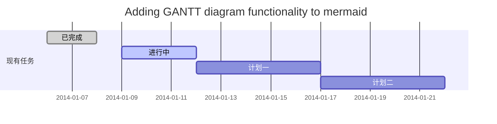
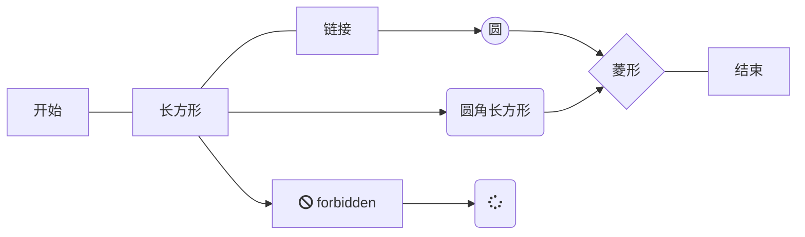
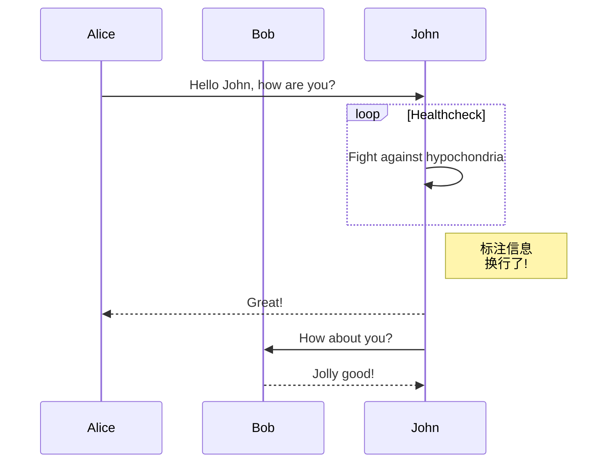

#### 欢迎使用Markdown语法编辑

### 功能快捷键

撤销：<kbd>Ctrl/Command</kbd> + <kbd>Z</kbd> <br>
重做：<kbd>Ctrl/Command</kbd> + <kbd>Y</kbd> <br>
加粗：<kbd>Ctrl/Command</kbd> + <kbd>B</kbd> <br>
斜体：<kbd>Ctrl/Command</kbd> + <kbd>I</kbd> <br>
标题：<kbd>Ctrl/Command</kbd> + <kbd>Shift</kbd> + <kbd>H</kbd> <br>
无序列表：<kbd>Ctrl/Command</kbd> + <kbd>Shift</kbd> + <kbd>U</kbd> <br>
有序列表：<kbd>Ctrl/Command</kbd> + <kbd>Shift</kbd> + <kbd>O</kbd> <br>
检查列表：<kbd>Ctrl/Command</kbd> + <kbd>Shift</kbd> + <kbd>C</kbd> <br>
插入代码：<kbd>Ctrl/Command</kbd> + <kbd>Shift</kbd> + <kbd>K</kbd> <br>
插入链接：<kbd>Ctrl/Command</kbd> + <kbd>Shift</kbd> + <kbd>L</kbd> <br>
插入图片：<kbd>Ctrl/Command</kbd> + <kbd>Shift</kbd> + <kbd>G</kbd> <br>
查找：<kbd>Ctrl/Command</kbd> + <kbd>F</kbd> <br>
替换：<kbd>Ctrl/Command</kbd> + <kbd>G</kbd> <br>

<br>

### 设置标题

输入1个 <kbd>#</kbd>，并按下 <kbd>space</kbd> 后，将生成1级标题。 <br>
输入2个 <kbd>#</kbd>，并按下 <kbd>space</kbd> 后，将生成2级标题。 <br>
以此类推，支持6级标题。有助于使用`TOC`语法后生成一个完美的目录。 <br>

<br>

### 改变文本的样式

`*强调文本*` _强调文本_

`**加粗文本**` __加粗文本__

`==标记文本==` ==标记文本==

`~~删除文本~~` ~~删除文本~~

`> 引用文本`

> 引用文本

`!> 危险警告文本`

!> 危险警告

`?> 一般警告` 

?> 一般警告

<br>

### 插入链接与图片

用法：`[张芳帅的博客](https://zhangfangshuai.github.io/studyStation)`

链接： [张芳帅的博客](https://zhangfangshuai.github.io/studyStation)


图片路径只能使用远程绝对路径。可以借用csdn的图片服务器。<br>
用法： `

<br>

### 列表样式

```markdown
- 项目
 - 项目
   - 项目

1. 项目1
2. 项目2
3. 项目3

- [ ] 计划任务
- [x] 完成任务
```

- 项目
 - 项目
   - 项目

1. 项目1
2. 项目2
3. 项目3

- [ ] 计划任务
- [x] 完成任务

<br>

### 创建表格
使用`:----:`居中，使用`:----`居左，使用`----:`居右

```markdown
| 第一列        | 第二列         | 第三列        |
|:-----------: | ------------: |:-------------|
| 第一列文本居中 | 第二列文本居右   | 第三列文本居左 |

```

| 第一列       | 第二列         | 第三列        |
|:-----------:| -------------:|:-------------|
| 第一列文本居中 | 第二列文本居右  | 第三列文本居左 |

<br>

### SmartyPants
SmartyPants将ASCII标点字符转换为“智能”印刷标点HTML实体。例如：

|    TYPE   |ASCII                          |HTML
|----------------|-------------------------------|-----------------------------|
|Single backticks|`'Isn't this fun?'`            |'Isn't this fun?'            |
|Quotes          |`"Isn't this fun?"`            |"Isn't this fun?"            |
|Dashes          |`-- is en-dash, --- is em-dash`|-- is en-dash, --- is em-dash|

<br>

---

<br>

!> 以下功能为笔者对markdown的扩充，使得文档看起来更友好，丰富，更高级


### 代码块支持配置多Tab

```markdown
<!-- tabs:start -->
#### **English**
Hello!
#### **French**
Bonjour!
#### **Italian**
Ciao!
<!-- tabs:end -->
```

<br>

### emoji表情支持

显示表情图标 `:100:` :100:
```markdown
:emojikey:
```

禁用解析成表情 `&#58;100:` &#58;100:

```markdown
_colon_;emojikey:  或
&#58;emojikey:
```

<br>

### 忽略某张图片缩放 
```markdown

```

<br>

### 自定义警示语

**信息警示引用**
```markdown
> [!NOTE]
> An alert of type 'note' using global style 'callout'. 
```

> [!NOTE]
> An alert of type 'note' using global style 'callout'. 

**信息警示引用，改写flat皮肤**
```markdown
> [!NOTE|style:flat]
> An alert of type 'note' using global style 'flat'. 
```

> [!NOTE|style:flat]
> An alert of type 'note' using global style 'flat'. 

**成功警示引用** `> [!TIP]`
```markdown
> [!TIP]
> An alert of type 'note' using global style 'callout'. 
```
> [!TIP]
> An alert of type 'success' using global style 'callout'.

**警告警示引用** `> [!WARNING]`
> [!WARNING]
> An alert of type 'warning' using global style 'callout'.

**危险警示引用** `> [!ATTENTION]`
> [!ATTENTION]
> An alert of type 'attention' using global style 'callout'.

**自定义样式警示引用**
`!TIP|style:flat|label:My own heading|iconVisibility:hidden`
> [!TIP|style:flat|label:My own heading|iconVisibility:hidden]
> An alert of type 'tip' using alert specific style 'flat' which overrides global style 'callout'.
> In addition, this alert uses an own heading and hides specific icon.

可以在现有的提示引用里改写如下配置，也可以在index.html里增加自定义提示，可选设置如下：

| 配置项           |    允许值        | 默认值               |
|:--------------: | :-------------: |:------------------: |
| style           | callout, flat   | callout             |
| label           | Any text        | ''                  |
| icon            | 合法的字体图标    | 如: ‘fas fa-comment’ |
| className       | 样式类名字符串    | ''                   |
| labelVisibility | visible, hidden | visible             |
| iconVisibility  | visible, hidden | visible             |

<br>

### 序列图 - plantuml版本

可以使用UML图表进行渲染。 例如下面产生的一个序列图：
```
张三 -> 李四: 你好！李四, 最近怎么样?
李四 -> 王五: 你最近怎么样，王五？
李四 --x 张三: 我很好，谢谢!
李四 -x 王五: 我很好，谢谢!
Note right of 王五: 李四想了很长时间... \n如果文字太长，使用\\n换行 \n我是换行后的文字.

李四-->>张三: 打量着王五...
张三->>王五: 很好... 王五, 你怎么样?
```

```plantuml
张三 -> 李四: 你好！李四, 最近怎么样?
李四 -> 王五: 你最近怎么样，王五？
李四 --x 张三: 我很好，谢谢!
李四 -x 王五: 我很好，谢谢!
Note right of 王五: 李四想了很长时间... \n如果文字太长，使用\\n换行 \n我是换行后的文字.

李四-->>张三: 打量着王五...
张三->>王五: 很好... 王五, 你怎么样?
```

<br>

### 甘特图 - mermaid

```
gantt
       dateFormat  YYYY-MM-DD
       title Adding GANTT diagram functionality to mermaid
       section 现有任务
       已完成               :done,    des1, 2014-01-06,2014-01-08
       进行中               :active,  des2, 2014-01-09, 3d
       计划一               :         des3, after des2, 5d
       计划二               :         des4, after des3, 5d
```


- 关于 **甘特图** 语法，参考 [这儿][2],

<br>

### 流程图 - Mermaid

绘制流程图需要指定语言类型为`mermaid`，且在代码配置区域第一行标记；`graph LR/TD`，其中，`LR`表示左右走向，`TD`表示上下走向。如下：

```
graph TD
   O[开始] --- A
   A[长方形] --- 链接 --> B((圆))
   A --> C(圆角长方形)
   B --> D{菱形}
   C --> D
   A --> E[fa:fa-ban forbidden]
   E --> F(fa:fa-spinner)
   D --- G[结束]
```



<br>

### 序列图 - mermaid

绘制序列图需要指定语言类型为`mermaid`，且在代码配置区域第一样标记；`sequenceDiagram`，如下：
```
sequenceDiagram
   participant Alice
   participant Bob
   Alice ->> John: Hello John, how are you?
   loop Healthcheck
       John ->> John: Fight against hypochondria
   end
   Note right of John: 标注信息 <br/>换行信息!
   John -->> Alice: Great!
   John ->> Bob: How about you?
   Bob -->> John: Jolly good!
```



- 关于 **Mermaid** 语法，参考 [这儿][1]


[1]: https://mermaidjs.github.io/