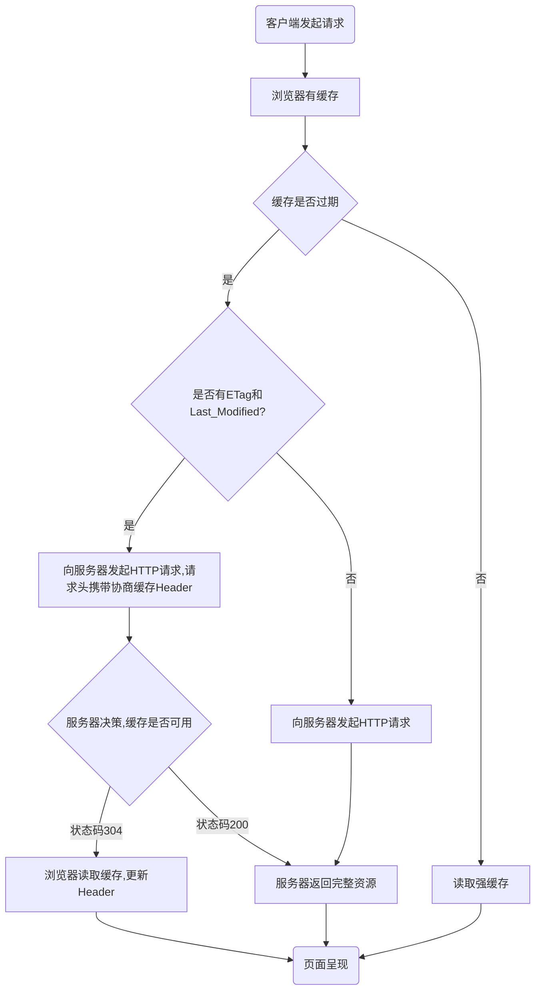
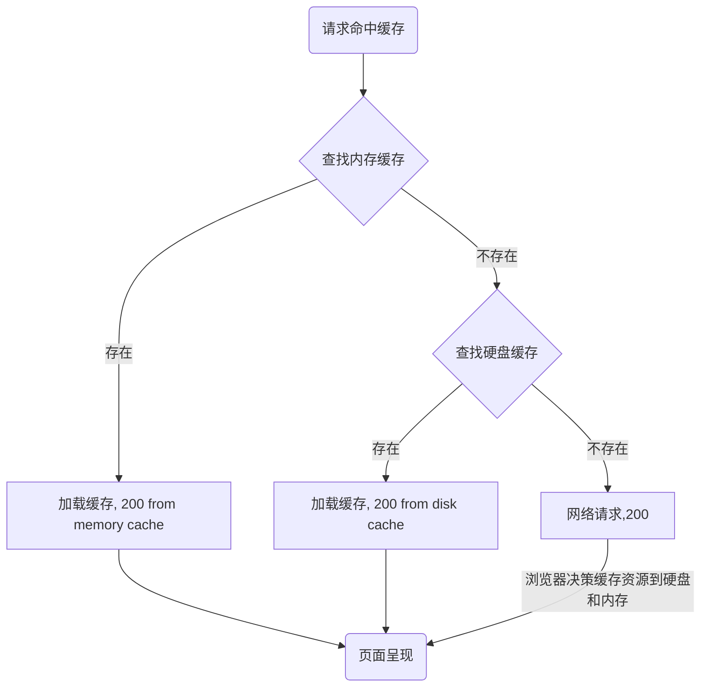

#### 强缓存与协商缓存

&emsp; 当用户在浏览器地址栏敲入一个地址后，经历了一系列复杂包括但不限于域名解析，DNS寻址，三次握手，资源缓存判断，服务器请求响应，跨域判断，浏览器资源解析，文件依赖分析，文件依赖下载，资源组装渲染等过程。

&emsp; 其中，资源缓存判断这一步，是我们本文要讨论的重点。
### 缓存认识

所谓缓存，就是第一次请求获取到数据后，将资源数据存储在本地。如果再次请求该资源且命中缓存，则读取本地的资源，服务器无需再次返回该资源数据。我们经常从浏览器中看到如下信息，就是缓存其中一种类别：

针对缓存的效率，给出一组数据供大家参考

|  server response |  memory cache | disk cache |  CPU cache |
| :--------------: | :-----------: | :--------: | :--------: |
|  500ms           |  10-20ms      | 100ns      |  0.5ns     |

**缓存优势：**
- 减少了不必要的数据传输，节约了带宽
- 减少服务器的负担，提升了网站的性能
- 加快了客户端加载网页的速度
- 用户体验友好

**缓存劣势：**
- 资源如果有更新，客户端页面信息可能出现滞后（使用不当情况下）

 

### 资源读取过程

<!--  -->

##### 第一次请求

##### 后续请求
以下展示一个大致流程，细节如对`Etag`判断，对`expire`判断命中强缓存等略过，更详细内容请继续往下阅读

使用文字描述为：

（1）<kbd>客户端发器请求</kbd> ===> <kbd>本地有缓存，检查强缓存配置</kbd> ===> <kbd>强缓存命中，读取本地缓存资源并返回</kbd> ===> <kbd>页面呈现</kbd>   

（2）<kbd>客户端发器请求</kbd> ===> <kbd>本地有缓存，强缓存未命中</kbd> ===> <kbd>检查上次请求`header`的协商缓存配置是否有`Etag`，有则请求头中添加`If_None_Match`，发起请求</kbd> ===> <kbd>服务器决策，命中缓存返回`304 Not Modified`；未命中返回`200`</kbd> ===> <kbd>页面呈现</kbd> （本路径其实还会检查`Last Modified`，此处略）。  

（3）<kbd>客户端发器请求</kbd> ===> <kbd>本地有缓存，强缓存未命中</kbd> ===> <kbd>协商缓存无`Etag`，检查协商缓存`Last Modified`</kbd> ===> <kbd>有则请求头中添加`If-Modified-Since`，发起请求</kbd> ===> <kbd>服务器决策，命中缓存返回`304 Not Modified`，未命中返回`200`</kbd> ===> <kbd>页面呈现</kbd>

 

### 强缓存

强缓存是直接从浏览器本地缓存中获取资源而不经过服务器，与强缓存相关的`header`字段有两个：

- `expires`: HTTP1.0 的规范，它的值为一个绝对时间的 GMT 格式的时间字符串，如`Mon, 15 Jun 2029 20:08:12 GMT`，如果发送请求的时间在`expires`之前，那么本地缓存始终有效，否则就会发送请求到服务器来获取资源

- `cache-control: max-age=number`：HTTP1.1 的规范，主要利用该字段的`max-age`值来进行判断；它是一个相对值，通过资源第一次请求时间和`Cache-Control`设定的有效期，计算出一个资源过期时间，在拿这个过期时间跟当前的请求时间比较，如果请求时间在过期时间之前，就能命中缓存，否则就不行，`cache-control`除了该字段外，还有下面几个比较常用的设置值:
    - `no-cache`：不使用本地缓存，需要使用协商缓存。客户端发起请求，如果请求头中已存在上次返回的`ETag`，那么与服务器验证，如未更改则更新缓存的请求头使用缓存，如已更改则重新下载完整资源。
    - `no-store`：禁用强缓存和协商缓存，每次用户请求该资源，服务器都会返回下载完整的资源
    - `public`： 可以被所有的用户缓存，包括终端用户和 cdn 等中间代理服务器
    - `private`： 只能被终端用户的浏览器缓存，不允许 cdn 等中缓存服务器对其缓存

?> 如果`expires`和`cache-control`同时存在，则使用更加新的http1.1的 `cache-control` 规则。

 

### 协商缓存

&emsp; 协商缓存都是由服务器来确定缓存资源是否可用，所以客户端与服务器端需要某种标识来进行通信，从而判断请求资源是否可以使用缓存。与协商缓存相关的`header`有两组搭档，且总是成对出现。它们是： 
（1）响应头`Last-Modified` 与 请求头`If-Modified-Since`； 
（2）响应头`Etag` 与 请求头`if-None-Match`。

&emsp;
##### 1、`Last-Modified`与`If-Modified-Since`

HTTP1.0规范中被提出。二者的值都是 **GMT 格式的时间字符串**，具体过程

1. 浏览器第一次向服务器请求一个资源，服务器在返回这个资源的同时，在`response`的`header`加上`Last-Modified`，表示这个资源在服务器上的最后修改时间
2. 浏览器再次请求该资源时，自动在`requestHeader`上添加`If-Modified-Since`，其值就是上一次请求时返回的`Last-Modified`
3. 服务器收到请求，发现`requestHeader`上有`If-Modified-Since`字段，则拿此时间和服务器上的最新修改时间进行对比： 
    - 如未发生变化，则返回HTTP-CODE`304 Not Modified`，但不返回资源内容，也不返回新的`header`
    - 如发生了变化，则返回HTTP-CODE`200`, 返回完整资源
4. 浏览器收到来自服务端的响应，检查HTTP-CODE：
    - 如果是`304 Not Modified`，则从缓存中读取资源，不更新`header`里`Last-Modified`信息。
    - 如果是`200`，表示协商缓存未命中，浏览器从服务器加载资源。`header`的`Last-Modified`会在重新加载的时候被更新，下次请求`If-Modified-Since`会使用新的`Last-Modified`的值。

&emsp;
##### 2、 `Etag` 与 `If-None_Match`

HTTP1.1规范中被提出。二者的值都是由服务端生产的每个资源的**唯一标识符**，只要资源有变化，这个值就会改变。

判断过程与`Last-Modified`与`If-Modified-Since`规则类似，不同的是：当服务器返回`304 Not Modified`响应时，由于`Etag`重新生成过，`response header`中还会把这个`Etag`返回，即使它跟之前没有变化。

&emsp;
##### 3、 既有`Last-Modified`又为何有`ETag`

使用`Last-Modified`已经足以让浏览器知道本地的缓存副本是否足够新，那为什么还需要`Etag`呢，HTTP1.1 中ETag的出现主要时为了解决几个`Last-Modified`比较难解决的问题

- 一些文件也许会周期性的更改，但是他的内容并不改变(仅仅改变的修改时间)，这个时候，我们并不希望客户端认为这个文件被修改了，而重新获取
- 某些文件修改非常频繁，比如在秒以下的时间内进行修改(比方说 1s 内修改了 N 次)，`If-Modified-Since`能检查到的粒度时 `s` 级的，这种修改无法判断(或者说 UNIX 记录 MTIME只能精确到秒)
- 某些服务器不能精确得到的文件的最后修改时间

这时，利用`ETag`能够更加准确的控制缓存，因为`ETag`是服务器自动生成或由开发者生成对应资源在服务器端的唯一的标识符，只要资源变化就改变该值，与时间无关

?>`Last-Modified`与`ETag` 是可以一起使用的，服务器会优先验证`ETag`，一致的情况下，才会继续比对`Last-Modified`，最后才决定是否返回`304`

 

### 缓存配置方案

缓存配置方案一般在Nginx中实现，通过配置`location`匹配资源类别进行区分配置，最佳实践如下：

- **`.html`：** 如 index.html，配置强缓存配置项`cache-control`为`no-store`，即永远取新资源。（`no-cache`利用协商缓存`Etag`命中缓存也可以，但笔者不太建议。）
- **`.css、.js`：** 文件名后追加MD5号或version号，使用`cache-control: no-cache`利用协商缓存命中。
- **`.jpg、.png、.gif`：** 同上，利用`cache-control: no-cache`利用协商缓存命中。

 

### 几种刷新的缓存机制

浏览器的刷新分为3种，分别是输入刷新操作、常规刷新操作、强制刷新操作。

##### 1. 输入刷新
操作表现为：  
（1）地址栏输入URL敲回车  
（2）或聚焦地址栏敲回车或点击`转到`  
（3）或页面上某个超链接跳转过来

这种方式的刷新，允许流浪起尽量少请求服务器，使用本地未过期的本地缓存。因此，强缓存和协商缓存均有参与判断。`Expires`对这种方式有效

##### 2. 常规刷新
操作表现为： 
（1）用户按 <kbd>F5</kbd> 键  
（2）用户按浏览器刷新暗按钮

常规刷新允许请求中附加必要的缓存协商，不允许使用本地缓存。即 强缓存失效，协商缓存参与判断。
此时`Expires`配置无效，`Last-Modified`仍参与判断

##### 3. 强制刷新
操作表现为： 
（1）用户按 <kbd>Ctrl</kbd> + <kbd>F5</kbd>

强制刷新规定只能使用服务器完整的资源，强缓存和协商缓存均不参与判断。

##### 4. 开发者开启Disable cache
此方式为开发者在浏览器控制台开启 Disable cache 选项，此时 强缓存和协商缓存均不参与判断

 

### 浏览器的缓存状态码

打开浏览器，打开控制台的Network，使用输入操作刷新页面，可以看到如下信息：

可以看到浏览器缓存分 memory cache 和 disk cache，且他们对应的http状态码均为置灰的200。

随便找一个cache资源，点击打开Header信息，在General下可以看到Status Code信息如下：

&emsp;

#####  1. 200 from memory cache

不访问服务器，直接读缓存，从内存中读取缓存。此时的数据时缓存到内存中的，当kill进程后，也就是浏览器关闭以后，数据将不存在(资源被释放掉了)。但是这种方式只能缓存派生资源。再次打开相同的页面时，不会出现`from memory cache`。

##### 2. 200 from disk cache

不访问服务器，已经在之前的某个时间加载过该资源，直接从硬盘中读取缓存，关闭浏览器后，数据依然存在，此资源不会随着该页面的关闭而释放掉下次打开仍然会是`from disk cache`。

##### 3. 200 + 资源大小数值

从服务器上下载的完整资源

##### 4. 304 Not Modified

访问服务器，协商缓存，服务器决策数据未更新返回304，从浏览器缓存中读取。

 

### 三级缓存原理

对于浏览器如何读取缓存，遵循三级缓存读取规则

 

### 总图

