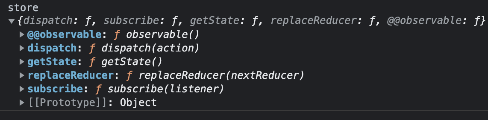

#### Redux-集中管理组件共享的状态

### 案例参考
[多组件共享redux状态](https://github.com/zhangfangshuai/react-redux)

### 什么是redux，与react啥关系
1. redux 是一个专门用于做状态管理的JS库，它不是React的插件库，也不是由React团队开发。
2. redux 本质上与react没有任何关系，就如java与javascript一样，仅是名字比较像而已。
3. 它可以用在react、angular、vue等项目中，但基本与react配合使用较多
4. 作用：集中式管理react应用中多个组件共享的状态

&emsp;

### 什么情况下需要使用redux

1. 某个组件的状态，需要让其他组件可以随时拿到（共享）
2. 一个组件需要改变任意关系的另一个组件的状态（通信）
3. 总体原则：能不用就不用，如父子组件等，如果不用时状态传递比较吃力，才考虑使用

&emsp;

### redux的工作流程（工作原理）


&emsp;

1. **React Components**：在组件中明确需要做什么（用于创建动作对象）
2. **Action Creators**：动作对象创建者：负责将组件要做的事包装成动作对象
    - action：动作对象（type:动作类型，data:动作数据） 如：'+ 1'; 动作类型为加，数据为1
    - dispatch(action)；分发动作事件
3. **store**：状态仓库。负责存储状态，同时将新产生的动作事件指定对应处理员，即Reducer
    - (previousState, action): 第一个参数：之前的值。action：动作对象。
4. **reducers**：真正执行动作事件的成员。他不管理状态，只负责计算。store将上一个数据和动作对象一起给reducer，reducer将计算完成的数据返回给仓库store。
5. store获取到新数据后存储起来，组件需要使用时找Store获取即可。


### redux三个核心概念

#### 1、action
action又称动作对象，包含两个属性
- type: 标识属性，值为字符串，唯一，必要属性。初始化为内置的`@@Redux/IINIT+随机值`
- data: 数据属性，值为任意类型，可选
  
案例： `{ type: 'ADD_STUDENT', data: {name: 'tom', age: 18} }`

#### 2、reducer
- reducer用于初始化状态、加工状态
- 加工时，根据旧的state和action，产生新的state的纯函数


#### 3、store
store用于将state、action、reducer联系在一起的对象

##### 如何得到此对象？
```js
import { createStore } from 'redux'
import reducer from './reducers'
const store = createStore(reducer)
```

##### 此对象的功能？
1. 通过`getState()`能得到state
2. 通过`dispatch(action)`分发action，触发reducer调用，产生新的state
3. 通过`subscribe(listener)`注册监听，当产生了新的state时，自动调用

#### 4、redux-store的全貌 
<div></div>

其中：
1. getState(): 获取store中保存的状态
2. subscribe(): 在react组件中检测store状态改变时，编写更新页面的逻辑（redux与react不互通，redux只负责管理store，与react无关）
3. dispatch(): react组件中，用于给store发布action
&emsp;

### redux的编写步骤

#### 1、定义动作type的常量
```js
// constant.js
/**
 * @func 该模块用于定义action对象中的type类型的常量
 */

export const INCREMENT = 'INCREMENT'
export const DECREMENT = 'DECREMENT'

```

#### 1、 编写Reducer
**定义reducer：创建为Count组件服务的reducer**
- reducer只干两件事：（1）初始化数据；（2）执行计算
- reducer函数会接到两个参数，分别为之前的状态（preState），动作对象（action）
- reducer 不处理条件判断，只管数据处理。因此，有if等条件判断时，需要在上游中控制
  

```js
// reducer.js
import {INCREMENT, DECREMENT} from './constant'

const initState = 0

export default function countReducer(preState=initState, action) {
    // 动作对象中有两个参数，type-动作类型，data-动作数据
    const { type, data = 0 } = action
    switch (type) {
        case INCREMENT:
            return preState + data
        case DECREMENT:
            return preState - data
        default:  // 如果没有动作对象，则表示要初始化
            return preState
    }
}
```

#### 2、编写store

store：redux中最为核心的成员，整个应用只能有一个store对象。
本案例使用`createStore`创建，在新版本中需要使用`configureStore`
```js
// store.js
// 引入createStore：专门用于创建redux中最为核心的store对象
import { createStore, applyMiddleware } from 'redux'

// 引入为Count组件服务的reducer
import countReducer from './count_reducer'
// 引入redux-thunk中间件，用于支持异步action
import thunk from 'redux-thunk'

// const store = configureStore({
//     reducer: {
//         // 定义一个名为`count`的顶级state字段，值为`countReducer`
//         count: countReducer
//     }
// })

const store = createStore(countReducer, applyMiddleware(thunk))

export default store

```

#### 3、编写action

```js
// action.js
/**
 * @func 专门为Count组件生成action对象
 */
import {INCREMENT, DECREMENT} from './constant'
// import store from './store'

// 同步action：action的值为Object类型的一般对象
export const createIncrementAction = data => ({ type: INCREMENT, data })
export const createDecrementAction = data => ({ type: DECREMENT, data })

// 异步action：即action的值为函数。因为函数可以开启异步任务
// 异步action需要使用中间件redux-thunk。需要给store传入第二个参数，用于加载中间件
// 异步action中一般回调用同步action
// 异步action不是必须要用的
export const createIncrementAsyncAction = (data, wait) => {
    // 该异步action是由store调用的，store会传入dispatch参数，因此无需自己引入store再调用
    return (dispatch) => {
        setTimeout(() => {
            // store.dispatch(createIncrementAction(data))
            dispatch(createIncrementAction(data))
        }, wait)
    }
}
```

#### 4、页面使用
在UI组件上引入redux核心成员store，以及创建的操作Action
```js
// Count.jsx组件
import React, { Component } from 'react'
import store from '../../redux/store'
import { createIncrementAction, createDecrementAction } from '../../redux/count_action'

export default class Count extends Component {
    increment = () => {
        const { value } = this.selectNumer
        store.dispatch(createIncrementAction(value * 1))
    }

    decrement = () => {
        const { value } = this.selectNumer
        store.dispatch(createDecrementAction(value * 1))
    }

    incrementAsync = () => {
        const { value } = this.selectNumer
        store.dispatch(createIncrementAsyncAction(value * 1))
    }
    
    render() {
        return (
            <div>
                <h2>当前求值为：{store.getState()}</h2>
                <select ref={c => this.selectNumer = c}>
                    <option value="1">1</option>
                    <option value="2">2</option>
                    <option value="3">3</option>
                </select> &emsp;
                <button onClick={this.increment}>+</button> &emsp;
                <button onClick={this.decrement}>-</button> &emsp;
                <button onClick={this.incrementAsync}>异步加</button>
            </div>
        )
    }
}
```
在根组件上创建redux状态state更新的监听
```js
// index.js根组件监听
import React from 'react'
import ReactDOM from 'react-dom/client'
import store from './redux/store'
import App from './App'

const root = ReactDOM.createRoot(document.getElementById('root'))
root.render(<React.StrictMode><App /></React.StrictMode>)

store.subscribe(() => {
    root.render(<React.StrictMode><App /></React.StrictMode>)
})
```


&emsp;

### Facebook出品的 react-redux

redux能协助react做状态管理，于是facebook封装了react-redux插件，为了更方便开发者redux

react-redux的模型图如下


&emsp;

#### react-redux的目标
1. 剥离react代码和redux代码，维持项目整洁
    - UI组件不引入和调用操作任何redux的相关代码，如`store.dispatch(createIncrementAction(value * 1))`、`store.getState()`、`store.subscribe()`等
    - 解决必须在react根组件上做`store.subscribe(() => {})`监听来更新页面的效果
2. 统一管理redux状态，分发action，简化代码
    - 容器组件负责react的UI组件与redux的通信
    - 借助`mapStateToProps`、`mapDispatchToProps`封装所有redux状态和操作Action
    - `mapDispatchToProps`可以简写为props方法与要dispatch的action的映射，且由react-redux代理调用redux的dispatch方法
    - 提供Provider，取消需要给容器组件传递store的需求，改为在根组件外层包裹一层`<Provider store={store}></Provider`


#### 容器组件
```js
// container/Count.jsx count的容器组件
import Count from '../../components/Count'
import { connect } from 'react-redux'

import {
    createIncrementAction,
    createDecrementAction,
    createIncrementAsyncAction
} from '../../redux/count_action'

// 容器组件的简写方法
const container = connect(
    // mapStateToProps映射状态
    state => ({ count: state }),
    // mapDispatchToProps映射操作状态的方法
    // react-redux自动通过dispatch分发action
    {
        increment: createIncrementAction,
        decrement: createDecrementAction,
        incrementAsync: createIncrementAsyncAction
    }
)(Count)

export default container
```

#### 使用react-redux后的页面的写法

```js
// component/Count.jsx UI组件
import React, { Component } from 'react'
import { createIncrementAction, createDecrementAction } from '../../redux/count_action'

export default class Count extends Component {
    increment = () => {
        const { value } = this.selectNumer
        // 调用props中容器组件的方法而非redux的store中的dispatch action
        this.props.increment(value * 1)
    }

    decrement = () => {
        const { value } = this.selectNumer
        this.props.decrement(value * 1)
    }

    incrementAsync = () => {
        const { value } = this.selectNumer
        this.props.incrementAsync(value * 1, 500)
    }
    
    render() {
        const { count } = this.props
        return (
            <div>
                {/* 从props中获取值，而非redux的store中 */)
                <h2>当前求值为：{count}</h2>
                <select ref={c => this.selectNumer = c}>
                    <option value="1">1</option>
                    <option value="2">2</option>
                    <option value="3">3</option>
                </select> &emsp;
                <button onClick={this.increment}>+</button> &emsp;
                <button onClick={this.decrement}>-</button> &emsp;
                <button onClick={this.incrementAsync}>异步加</button>
            </div>
        )
    }
}
```

根组件使用`Provider`注入`store`。原先的`store.subscribe(() => {})`已经不需要了，因为react-redux能自动监听并重新`render`页面
```js
// index.js
import React from 'react'
import ReactDOM from 'react-dom/client'
import { Provider } from 'react-redux'
import store from './redux/store'
import App from './App'

const root = ReactDOM.createRoot(document.getElementById('root'))
root.render(
    <React.StrictMode>
        {/* Provider给所有的容器组件提供redux的store */}
        <Provider store={store}>
            <App />
        </Provider>
    </React.StrictMode>
)
```

&emsp;

### 【最佳实践】容器组件与UI组件整合写法

引入react-redux后，容器组件和UI组件需要单独写一个文件，这引起了项目文件量剧增，如果觉得文件过多，建议把他们整合成一个文件的写法。

支持这种做法的原因是，只有容器组件会对外暴露，UI组件本质上只是容器组件的一个内部组件而已。

```js
import React, { Component } from 'react'
import { connect } from 'react-redux'
import {
    createIncrementAction,
    createDecrementAction,
    createIncrementAsyncAction
} from '../../redux/count_action'

// UI组件
class Count extends Component {
    increment = () => {
        const { value } = this.selectNumer
        this.props.increment(value * 1)
    }

    decrement = () => {
        const { value } = this.selectNumer
        this.props.decrement(value * 1)
    }

    incrementAsync = () => {
        const { value } = this.selectNumer
        this.props.incrementAsync(value * 1, 500)
    }
    
    render() {
        const { count } = this.props
        return (
            <div>
                <h2>当前求值为：{count}</h2>
                <select ref={c => this.selectNumer = c}>
                    <option value="1">1</option>
                    <option value="2">2</option>
                    <option value="3">3</option>
                </select> &emsp;
                <button onClick={this.increment}>+</button> &emsp;
                <button onClick={this.decrement}>-</button> &emsp;
                <button onClick={this.incrementAsync}>异步加</button>
            </div>
        )
    }
}

// 容器组件
const container = connect(
    // mapStateToProps映射状态
    state => ({ count: state }),
    // mapDispatchToProps映射操作状态的方法
    {
        increment: createIncrementAction,
        decrement: createDecrementAction,
        incrementAsync: createIncrementAsyncAction
    }
)(Count)

export default container
```


#### 整合写法总结
1. 为减少文件个数，容器组件和UI组件可以整合成一个文件，因最终暴露的是容器组件，而UI组件只是在容器组件中引用，所以应该把UI组件整合到容器组件中
2. 无需自己给每个容器组件传递store，使用react-redux插件提供的Provider在App组件中统一传入，Provider会自动查找App下所有容器组件，并注入store
3. react-redux插件提供的connect()()其实做了很多事情，除了连接redux和UI组件的基本功能外，还自动检测redux状态发生改变，重新调用render函数更新页面等，因此无需再手动调用store.subscribe()检测store变化，去render(App)
4. connect()()第一个括号的第二个参数mapDispatchToProps，可以简写成一个对象，由react-redux插件自动去调用dispatch实现action的分发

#### 组件与redux通信开发过程
1. 定义UI组件 --- 不暴露
2. 引入connect函数生成一个容器组件，并暴露，写法为
```
connect(
    state => ({ key: value })
    { key: xxxAction }
)(UI组件)
```
3. 在UI组件中通过this.props.xxx读取状态和操作状态的方法


### 【最佳实践】使用configerStore

当项目逐渐庞大，涉及多组件共享redux数据时，我们需要拆分`reducer`，也就需要创建多个`reducer`模块，此时就不能简单通过`createStore`来创建`store`，而是使用`combineReducer`先构造出`rootReducer`后再创建。
```js

import { createStore, combineReducers, applyMiddleware } from 'redux'
import thunk from 'redux-thunk'

import CountReducer from './reducers/count'
import PersonReducer from './reducers/person'

const rootReducer = combineReducers({
    count: CountReducer,
    person: PersonReducer
})
export default createStore(rootReducer, applyMiddleware(thunk))
```
这种做法的几个过程是：
- 将 slice reducers 组合在一起形成根 reducer
- 将根 reducer 导入到 store 文件中
- 导入 thunk middleware、applyMiddleware 和 composeWithDevTools API
- 使用 middleware 和 devtools 创建 store enhancer
- 使用根 reducer 创建 store

然而可以使用插件@reduxjs/toolkit的`configureStore`来简化这个流程
```js
import { configureStore } from '@reduxjs/toolkit'
import count from './reducers/count'
import person from './reducers/person'

export default configureStore({
    reducer: {
        count,
        persons
    }
})
```


