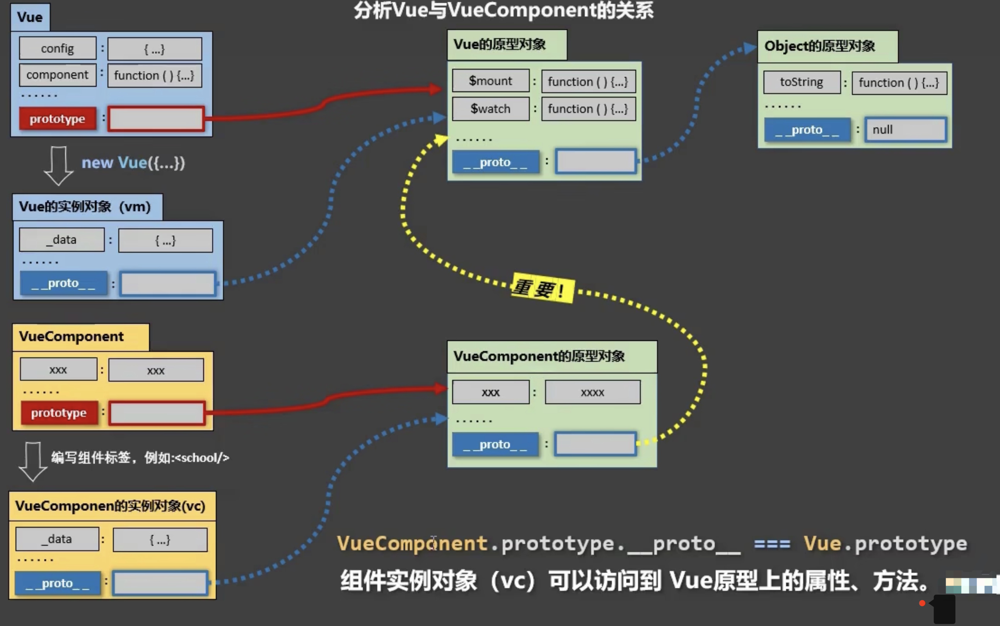

#### Vue和VueComponent的关系


### 定义一个vue组件
```js
/**
 * @func API方式的两种方式
 * （1）简写形式用对象定义，当在vm中注册组件，配置components:{school}时，Vue会帮你调用Vue.extend()
 * （2）直接使用 Vue.extend()定义
 */
const school = Vue.extend({
    // el: '#root'  // 注意注册组件时一定不能配置el，因为组件不能单独挂载到dom上，而必须依赖vm存在
    data() { // 组件的data必须返回一个函数，目的是组件被复用时，保证不同组件的data互相不干扰
        return {
            cName: 'school component'
        }
    }，
    template: // 当配置template后，Vue就会解析该配置，不再去解析标签<template>里的内容。此处使用模板字符串支持换行编写
    `
        <div>
            {{ cName }}
        </div>
    `,
    component: {
        ...  // 这里注册school的子组件，当然这不是本案例的重点
    }
})

// 查看组件是什么
console.log(school)  // f VueComponent (options) { this.init(options); } 
```
也就是说，school是一个名为VueComponent的构造函数。

&nbsp;


### 在vm上注册组件
本步骤完成两件事 <br>
（1）实例化一个Vue，得到vm；<br>
（2）注册以上定义的组件<br>

```js
/**
 * @func 实例化Vue
 */
const vm = new Vue({
    el: '#root', // 标注vue要挂载的节点位置。如果没配，vue会等待代码执行vm.$mount()方法执行，再进行后续的解析.
    components: { school } // 局部方式注册组件。组件名与组件变量同名，触发对象简写形式
})

// Vue.components('School', school)  // 全局注册一个组件，这不是本文的重点

console.log(vm) // Vue {...}
```
也就是说，vm是一个Vue的实例对象。注意这里与组件的区别，组件是一个VueComponent构造函数

&nbsp;

### 组件本质是什么

从以上可以得知，组件本质上是一个名为VueComponent的构造函数，且由`Vue.extend()`生成的。

在页面上，我们只要写`<school />`或`<school></school>`，Vue在解析时会帮我们创建school组件的实例对象，即Vue帮我们执行的 `new VueComponent(options)`

`new VueComponent()`的到的是vc，又叫 组件实例对象；
与之对比，`new Vue()`的到的是vm，又叫 Vue实例对象

!> 特别注意：每次调用`Vue.extend()`，返回的都是一个全新的VueComponent！！！原因如下

&nbsp;

### Vue.extend干了什么

Vue源码中，定义Vue.extend的部分逻辑如下：

```js
Vue.extend = function(extendOptions = {}) {
    /* ....... */
    var Sub = function VueComponent(options) {
        this._init(options)
    }
    /* ....... */
    return Sub
}
```
从代码中可以看出，`vue.extend`每次执行，都会生成一个新的VueComponent构造函数并返回，也就是说，我们每次定义一个对象，都是不同的VueComponent，他们之间不会互相干扰，换句话说就是，所有的组件都是独立的。

> 因为组件自身是独立的，但组件会接收传入的一组数据options，如果这组数据是带有引用类型的数据，如把data定义成了对象，那么不同组件依旧会互相干扰，因此vue会要求定义组件时data的配置必须时一个函数的返回值

&nbsp;

### 关于this指向说明
有了以上说明，不难得出

##### 1、在组件的配置中
data函数、methods中的函数、watch中的函数、computed中的函数等，他们的this均是【VueComponent实例对象】

##### 2、在new Vue(options)中
data函数、methods中的函数、watch中的函数、computed中的函数等，他们的this均是【Vue实例对象】、

&nbsp;

### 一个重要的内置关系

要说这个内置关系，先从如下图开始

<div></div>

Vue手动修改了VueComponent原型对象的隐式原型指向，把它从指向Object的原型对象改成了Vue的原型对象，其目的只有一个，就是把Vue的原型对象上的属性和方法，也提供给组件vc使用

当然，如果你去尝试 `VueComponent.prototype.__proto__ === Vue.prototype `，是会报错的，因为 并不直接存在`VueComponent`，它是`Vue。extend`生成的，改成如下即可
```js
school.prototype.__proto__ === Vue.prototype
```
