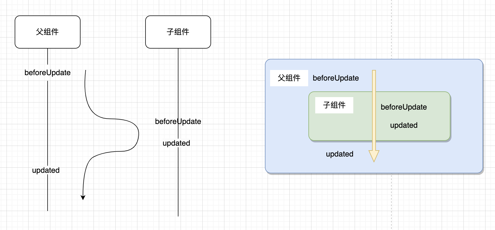

#### Vue父子组件之间生命周期的执行顺序

### 1. 各生命周期及特征
单组件内，生命周期钩子函数执行顺序如下

##### # `beforeCreate`
1. 该阶段只初始化了实例，事件，和生命周期函数；
2. 此时还不能访问data中的数据（data中的数据还未代理到vm上，还未执行_data中所有属性的getter/setter）

##### # `created`
实例创建完成，还未挂载；<br>
此时可以访问`props`、`data`、`computed`、`watch`、`methods`都能被访问到，但不能访问DOM元素 `$el`。<br>
可以在这里发起初始化页面的异步接口请求

##### # `beforeMount`
挂载之前调用，render函数首次被执行

##### # `mounted`
实例挂载完成。此时可以访问DOM，`vm.$el`、`this.$refs`<br>
注意 mounted 不会保证所有的子组件也都被挂载完成。如果你希望等到整个视图都渲染完毕再执行某些操作，可以在内部使用 `vm.$nextTick`

##### # `beforeUpdate`
数据发生改变后，DOM 被更新之前。
可以在现有 DOM 将要被更新之前访问它，比如移除手动添加的事件监听器。

##### # `updated`
数据更改导致的虚拟 DOM 重新渲染和更新完毕之后
在此期间应该避免再更改状态，如果需要，请使用计算属性或侦听器。

##### # `activated`
被 keep-alive 缓存的组件激活时调用

##### # `deactivated`
被 keep-alive 缓存的组件失活时调用

##### # `beforeDestroy`
实例销毁之前调用。在这一步，实例仍然完全可用。
常用来移除事件监听等，如`window.removeEventListener(‘online’, handler)`、`this.$bus.$off`等

##### # `destroyed`
实例销毁后调用。很少用

##### # `errorCaptured`
在捕获一个来自后代组件的错误时被调用 <br>
**格式：**错误对象，发生组件，错误信息 `(err: Error, vm: Component, info: string) => ?boolean`，可返回一个bool值代表是否继续向父级传递。
可以在此钩子中修改组件的状态，在捕获错误时，在模板或渲染函数中执行一个条件判断来替换原页面。

错误传播规则：
- 默认情况下，如果全局的 `config.errorHandler` 被定义，所有的错误仍会发送它，因此这些错误仍然会向单一的分析服务的地方进行汇报。
- 如果一个组件的 `inheritance chain` (继承链)或 `parent chain` (父链)中存在多个 `errorCaptured` 钩子，则它们将会被相同的错误逐个唤起。
- 如果此 `errorCaptured` 钩子自身抛出了一个错误，则这个新错误和原本被捕获的错误都会发送给全局的 `config.errorHandler`。
- 一个 `errorCaptured` 钩子能够返回 `false` 以阻止错误继续向上传播。本质上是说“这个错误已经被搞定了且应该被忽略”。它会阻止其它任何会被这个错误唤起的 `errorCaptured` 钩子和全局的 `config.errorHandler`。


<div class="center"></div>


### 2. 父子组件加载渲染过程

<div class="center"></div>

### 3. 子组件更新过程

<div class="center"></div>


### 5. 销毁过程
```plantuml
父组件 -> 子组件: 父 beforeDestroy
子组件 -> 父组件: 子 beforeDestroy
子组件 -> 父组件: 子 destroyed
父组件 -> 子组件: 父 destroyed
```